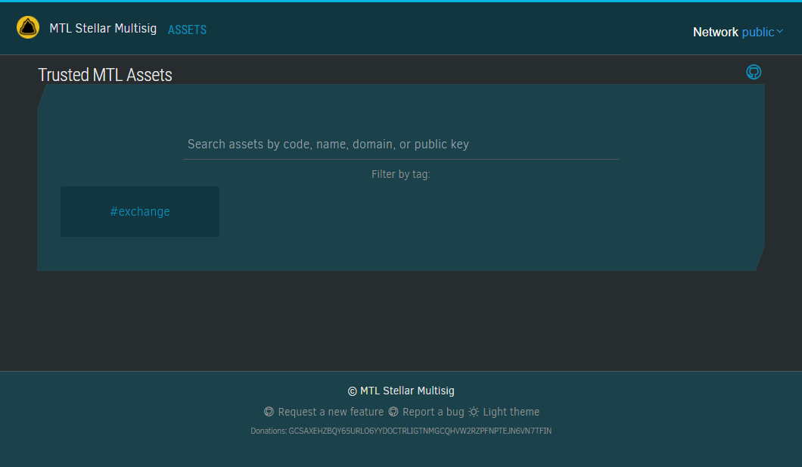

# mtl-stellar-multisig-dapp

MTL Stellar Multisig wallet assets dApp using `Next.js` + `RTK` + `TailwindCSS`

```bash
$ npm install
$ npm run dev
```



Live: [stellar-multisig.montelibero.org](https://stellar-multisig.montelibero.org)

The repository is a part of the [Montelibero Organization](https://github.com/montelibero-org). This project and everyone participating in it is governed by the [Code of Conduct](CODE_OF_CONDUCT.md).

&copy; 2024 @codeguru827

All rights reserved.
